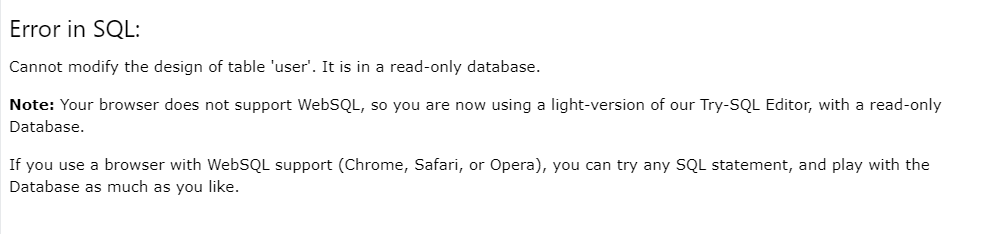

# Q3 - SQL Scripts

Due to some technical Error I couldn't use the `Try-SQL Editor`
I attached a image showing the error. (Browser: Google Chrome)

## Deployment

I used MySql to create the scripts. All these script can execute using MySql Workbench or Anything smilar.

